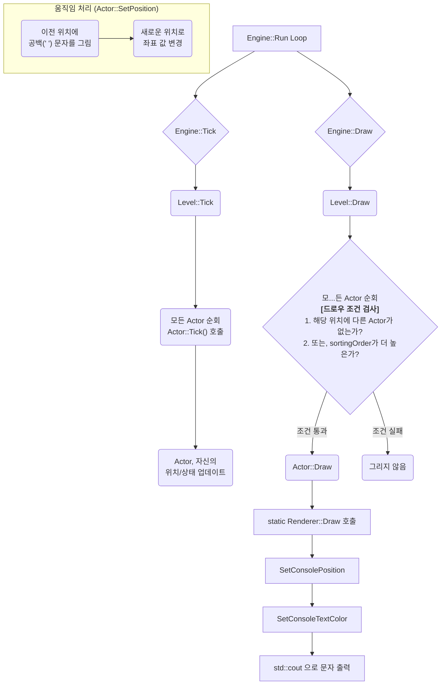

### 코드 기반 렌더링 파이프라인 정밀 분석

#### **1단계: `Engine::Run()` - 게임 루프의 시작**

*   **위치**: `Engine/Engine/Engine.cpp`

프로그램이 시작되고 `engine.Run()`이 호출되면, `Engine.cpp`의 `Run()` 함수 안에 있는 `while (!isQuit)` 루프가 실행됩니다. 이 루프가 게임의 메인 루프이며, 프레임 단위로 다음 함수들을 순서대로 호출합니다.

1.  `Tick(deltaTime)`: 게임 월드의 논리적 상태를 업데이트합니다.
2.  `Draw()`: 업데이트된 상태를 화면에 그립니다.

#### **2단계: `Engine`에서 `Level`로의 호출 전달**

*   **위치**: `Engine/Engine/Engine.cpp`

`Engine`의 `Tick()`과 `Draw()` 함수는 실제 작업을 직접 수행하지 않습니다. 코드를 보면 두 함수 모두 현재 설정된 `mainLevel`이 유효한지 확인한 후, `mainLevel`의 `Tick()`과 `Draw()` 함수를 각각 호출해주는 **전달자(Passthrough)** 역할을 합니다.

```cpp
// Engine::Tick() 구현
void Engine::Tick(float deltaTime)
{
    if (!mainLevel) return;
    mainLevel->Tick(deltaTime); // Level의 Tick을 호출
}

// Engine::Draw() 구현
void Engine::Draw()
{
    if (!mainLevel) return;
    mainLevel->Draw(); // Level의 Draw를 호출
}
```

#### **3단계: `Level`의 역할 - `Actor` 순회 및 드로우 조건 검사**

*   **위치**: `Engine/Level/Level.cpp`

`Level`은 `Actor` 객체들의 컨테이너(`std::vector<Actor*> actors`) 역할을 합니다.

1.  **`Level::Tick()`**: 이 함수는 자신이 담고 있는 모든 `Actor`를 `for` 루프로 순회하며, 각각의 `actor->Tick(deltaTime)`을 호출합니다. 이를 통해 각 `Actor`가 자신의 위치나 상태를 업데이트할 기회를 갖습니다.

2.  **`Level::Draw()`**: 이 함수가 렌더링의 핵심 규칙을 포함하고 있습니다. 단순히 모든 `Actor`의 `Draw()`를 호출하는 것이 아니라, 다음과 같은 **조건부 렌더링** 로직을 실행합니다.
    *   `actors` 벡터를 순회하는 외부 루프와 내부 루프, 총 2개의 `for` 루프를 사용합니다.
    *   특정 `Actor`를 그리기 전에, 같은 위치(`position`)에 다른 `Actor`가 있는지 검사합니다.
    *   **만약 같은 위치에 다른 `Actor`가 없다면** 즉시 `actor->Draw()`를 호출합니다.
    *   **만약 같은 위치에 다른 `Actor`가 있다면**, 두 `Actor`의 `sortingOrder` 값을 비교합니다. 현재 `Actor`의 `sortingOrder`가 더 높을 경우에만 `actor->Draw()`를 호출합니다.

이 로직은 콘솔의 한 좌표에 여러 문자가 겹쳐서 그려지는 것을 방지하는 일종의 Z-버퍼링(Z-buffering) 역할을 합니다. `sortingOrder`가 높은 `Actor`가 우선적으로 그려집니다.

#### **4단계: `Actor`의 역할 - `Renderer` 최종 호출**

*   **위치**: `Engine/Actor/Actor.cpp`

`Level::Draw()`의 조건을 통과한 `Actor`는 자신의 `Draw()` 메소드를 실행합니다.

*   `Actor::Draw()` 함수는 다음 한 줄의 코드로 구현되어 있습니다.
    ```cpp
    void Actor::Draw()
    {
        // 렌더러에게 자신의 위치, 색상, 모양을 전달하여 그리기를 최종 요청
        Renderer::Draw(position, color, image);
    }
    ```
*   이 코드는 `Actor`가 자신의 상태(`position`, `color`, `image`)를 `static` 함수인 `Renderer::Draw()`에 전달하여 화면에 문자를 출력하도록 최종 요청하는 부분입니다.

*   **보너스 분석: `Actor::SetPosition()`**
    `Actor`가 움직일 때의 처리도 코드에 명확히 구현되어 있습니다. `SetPosition()` 함수는 새로운 위치로 좌표를 바꾸기 직전에, 이전 위치에 공백(`' '`)을 그리는 `Renderer::Draw(position, ' ');` 코드를 호출합니다. 이는 `Actor`가 움직일 때 이전 위치의 잔상을 지우는 역할을 합니다.

#### **5단계: `Renderer`의 실제 동작 - 콘솔에 문자 출력**

*   **위치**: `Engine/Core/Renderer.h`

`Renderer::Draw(position, color, image)` 함수는 주석으로 처리된 버퍼링 로직과 관계없이 다음과 같이 **직접적이고 즉시적인** 드로잉을 수행합니다.

1.  `Util::SetConsolePosition(position)`: 콘솔 커서를 `Actor`의 좌표로 이동시킵니다.
2.  `Util::SetConsoleTextColor(color)`: 문자의 색상을 설정합니다.
3.  `std::cout << image;`: 해당 커서 위치에 문자를 출력합니다.

---

### 코드 기반 분석 요약 및 도식화

앞선 분석에서 놓쳤던 **`Level::Draw()`의 조건부 렌더링**과 **`Actor::SetPosition()`의 잔상 제거** 로직이 실제 코드에 구현된 핵심적인 부분이었습니다.

